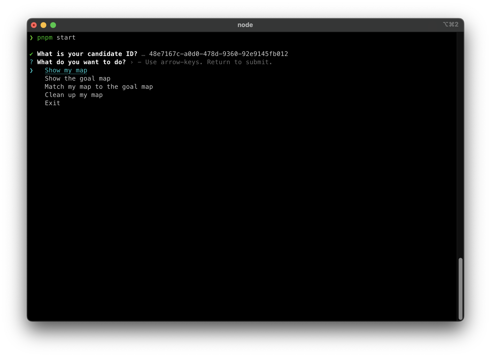

# Crossmint Challenge

This challenge was developed as part of the Crossmint interview process for Full Stack Engineer.

## Description

Megaverses are 2D spaces comprised of combinations of different astral objects: 🪐POLYanets with 🌙SOLoons around them and ☄comETHs floating around.

The challenge was composed of 2 phases. In the first one I learned how to interact with the API and create some 🪐POLYanets and validate them. In the second one a bigger megaverse was created with some peculiar shape.

## Getting Started

In order to run the project, you'll need to have [pnpm](https://pnpm.io/) installed. Then you can run the following commands:

```bash
$ pnpm install
$ pnpm start
```

Then you'll be greated with the following screen:



That's it! You can now interact with the CLI.

## Configuration

The project has a `.env` file with the following variables:

- `MEGAVERSE_API_BASE_URL`: The base URL of the API. Defaults to `https://challenge.crossmint.io/api`.
- `CANDIDATE_ID`: The candidate ID. Can be also configured through the CLI.
- `VERBOSE`: If set to `true`, the CLI will fully log errors. Defaults to `false`.

It can be configured by creating a `.env` file (you can use `.env.example` as a template) or by setting the environment variables directly.

None of the variables are mandatory, but if you don't set `CANDIDATE_ID` you'll have to enter it every time you run the CLI.

Variables have validation, so if you set them to an invalid value the CLI will error out.

## CLI

Using the CLI you can perform the following commands:

- Show my map
- Show the goal map
- Match my map to the goal map
- Clean up my map

Unfortunately, the API stops working on challenge submission, so screenshots couldn't be made.

## Stack

- TypeScript
- Node.js
